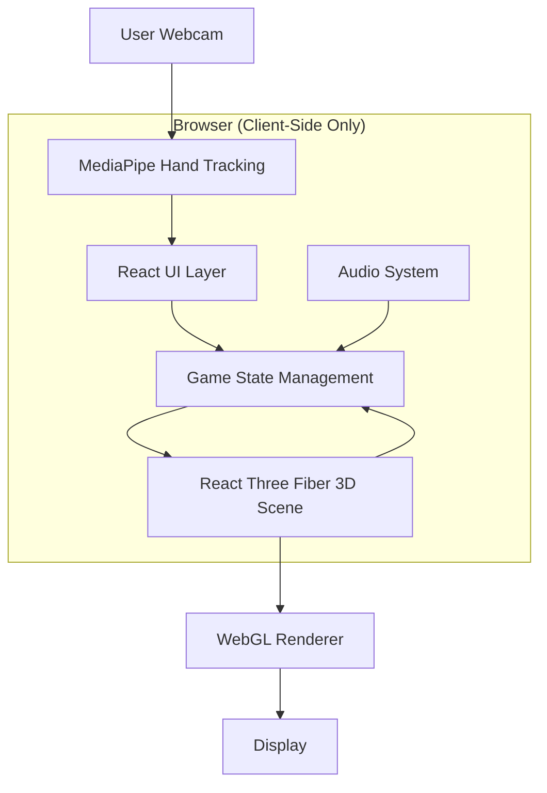

# Design: Naruto Hand Seals Game

## 1. Technical Stack

### 1.1 Core Technologies

| Technology | Version | Purpose | Rationale |
|-----------|---------|---------|-----------|
| **React** | 19.2.0 | UI Framework | Component-based architecture, excellent ecosystem |
| **TypeScript** | ~5.9.3 | Type Safety | Catch errors at compile-time, better DX |
| **Vite** | 7.2.4 | Build Tool | Lightning-fast HMR, optimized builds |
| **Three.js** | 0.182.0 | 3D Rendering | Industry-standard WebGL library |
| **React Three Fiber** | 9.5.0 | 3D Framework | Declarative Three.js with React patterns |
| **@react-three/drei** | 10.7.7 | R3F Helpers | Common 3D utilities and components |
| **MediaPipe Tasks Vision** | 0.10.32 | Hand Tracking | Google's ML solution for gesture recognition |
| **Tailwind CSS** | 4.1.18 | Styling | Utility-first CSS, rapid prototyping |

### 1.2 Development Tools

- **ESLint** + **TypeScript ESLint**: Code quality enforcement
- **Prettier**: Code formatting consistency
- **PostCSS** + **Autoprefixer**: CSS compatibility

---

## 2. Architecture Overview

### 2.1 High-Level Architecture



**Key Architectural Decisions**:
- **Client-Only Architecture**: No backend server, pure browser-based game
- **Declarative 3D**: React Three Fiber for maintainable 3D code
- **Separation of Concerns**: Clear boundaries between gesture detection, game logic, and rendering
- **Performance-First**: useFrame for efficient animation loop, useMemo for expensive computations

### 2.2 Component Hierarchy

```
App.tsx (Root)
├── GameScene.tsx (3D World Manager)
│   ├── <Canvas> (R3F Root)
│   │   ├── Starfield (Background)
│   │   ├── GameLogic (Game State Updates)
│   │   ├── EnemyMesh[] (Enemy Entities)
│   │   ├── JutsuMesh[] (Projectiles)
│   │   └── ExplosionParticles[] (Effects)
│   └── Lights (Ambient + Directional)
├── HUD Elements (Overlay UI)
│   ├── ChakraBar
│   ├── ScoreDisplay
│   ├── ComboIndicator
│   ├── SealSequence
│   ├── WebcamFeed
│   └── JutsuCheatSheet
└── Modals
    ├── StartScreen
    └── GameOverScreen
```

---

## 3. Component Design

### 3.1 App.tsx - Main Controller

**Responsibilities**:
- Initialize MediaPipe GestureRecognizer
- Manage game state (chakra, score, combo, enemies, jutsu)
- Handle webcam stream and gesture detection
- Coordinate between gesture input and game logic
- Render HUD and modals

**Key State**:
```typescript
interface GameState {
  chakra: number;           // Current chakra energy
  maxChakra: number;        // Maximum chakra capacity
  score: number;            // Player's current score
  combo: number;            // Current combo multiplier
  comboTimer: number;       // Seconds remaining for combo
  currentSeals: SealType[]; // Active seal sequence
  enemies: Enemy[];         // Active enemy entities
  jutsuInstances: JutsuInstance[]; // Active projectiles
  isGameOver: boolean;      // Game state flag
  wave: number;             // Current difficulty wave
}
```

**MediaPipe Integration**:
```typescript
// Initialization
const vision = await FilesetResolver.forVisionTasks(CDN_URL);
const recognizer = await GestureRecognizer.createFromOptions(vision, {
  baseOptions: {
    modelAssetPath: GOOGLE_STORAGE_URL,
    delegate: "CPU"
  },
  runningMode: "VIDEO",
  numHands: 1
});

// Real-time Recognition Loop
const predictWebcam = () => {
  const results = recognizer.recognizeForVideo(video, Date.now());
  const gestureType = detectNinjaSeal(results.landmarks[0]);
  const sealType = getSealType(gestureType);

  // Update seal sequence with cooldown
  if (sealType && Date.now() - lastGesture > 500ms) {
    setGameState(prev => ({
      ...prev,
      currentSeals: [...prev.currentSeals, sealType]
    }));
  }

  requestAnimationFrame(predictWebcam);
};
```

### 3.2 GameScene.tsx - 3D World Manager

**Architecture**: React Three Fiber declarative approach (NOT vanilla Three.js)

**Why R3F over Vanilla Three.js?**
- ✅ React lifecycle management (automatic cleanup)
- ✅ Declarative syntax (easier to understand)
- ✅ Component reusability
- ✅ Better state synchronization with React
- ✅ useFrame hook for animation loops

**Component Structure**:

```typescript
export const GameScene: React.FC<GameSceneProps> = ({ gameState, onGameStateUpdate }) => {
  return (
    <div className="w-full h-full absolute top-0 left-0 z-0">
      <Canvas camera={{ position: [0, 0, 10], fov: 75 }} gl={{ antialias: true }}>
        {/* Lighting */}
        <ambientLight intensity={0.5} />
        <directionalLight position={[5, 10, 5]} intensity={0.8} />

        {/* Background */}
        <Starfield />

        {/* Game Logic (useFrame loop) */}
        <GameLogic gameState={gameState} onGameStateUpdate={onGameStateUpdate} />

        {/* Entities */}
        {gameState.enemies.map(enemy => (
          <EnemyMesh key={enemy.id} enemy={enemy} />
        ))}

        {gameState.jutsuInstances.filter(j => j.active).map((jutsu, i) => (
          <JutsuMesh key={`${jutsu.jutsu.id}_${i}`} jutsuInstance={jutsu} />
        ))}
      </Canvas>
    </div>
  );
};
```

**Sub-Components**:

#### Starfield (Background)
```typescript
function Starfield() {
  const geometry = useMemo(() => {
    const geo = new THREE.BufferGeometry();
    const positions = new Float32Array(1000 * 3);
    for (let i = 0; i < 1000 * 3; i += 3) {
      positions[i] = (Math.random() - 0.5) * 100;     // x
      positions[i + 1] = (Math.random() - 0.5) * 100; // y
      positions[i + 2] = (Math.random() - 0.5) * 100; // z
    }
    geo.setAttribute('position', new THREE.BufferAttribute(positions, 3));
    return geo;
  }, []);

  return (
    <points geometry={geometry}>
      <pointsMaterial color={0xffffff} size={0.1} />
    </points>
  );
}
```

#### EnemyMesh (Enemy Entity)
```typescript
function EnemyMesh({ enemy }: { enemy: Enemy }) {
  const meshRef = useRef<THREE.Mesh>(null);

  useFrame((_, delta) => {
    if (!meshRef.current) return;

    // Update position based on velocity
    enemy.position.add(enemy.velocity.clone().multiplyScalar(delta));
    meshRef.current.position.copy(enemy.position);

    // Boundary collision (bounce)
    if (Math.abs(enemy.position.x) > 12) enemy.velocity.x *= -1;
    if (Math.abs(enemy.position.y) > 8) enemy.velocity.y *= -1;

    // Visual rotation
    meshRef.current.rotation.y += delta;
  });

  return (
    <mesh ref={meshRef} position={enemy.position.toArray()}>
      <cylinderGeometry args={[0.3, 0.3, 1, 16]} />
      <meshStandardMaterial
        color={enemy.mesh.material.color}
        emissive={new THREE.Color(0.2, 0.2, 0.2)}
      />
    </mesh>
  );
}
```

#### GameLogic (Core Game Loop)
```typescript
function GameLogic({ gameState, onGameStateUpdate }) {
  const enemySpawnTimerRef = useRef(0);

  useFrame((_, delta) => {
    if (gameState.isGameOver) return;

    // Enemy Spawning
    enemySpawnTimerRef.current += delta;
    if (enemySpawnTimerRef.current > 2 && gameState.enemies.length < 4) {
      const newEnemy = createEnemy();
      onGameStateUpdate({ enemies: [...gameState.enemies, newEnemy] });
      enemySpawnTimerRef.current = 0;
    }

    // Collision Detection
    gameState.jutsuInstances.forEach(jutsu => {
      if (!jutsu.active) return;
      gameState.enemies.forEach(enemy => {
        const distance = jutsu.position.distanceTo(enemy.position);
        if (distance < 1) {
          // Hit detected
          enemy.health -= jutsu.jutsu.damage;
          jutsu.active = false;
          audioService.playHitSound(gameState.combo);

          // Update combo and score
          onGameStateUpdate({
            combo: gameState.combo + 1,
            comboTimer: 3,
            score: gameState.score + 100 * (gameState.combo + 1)
          });

          // Enemy death
          if (enemy.health <= 0) {
            audioService.playExplosion();
            // Trigger explosion particles
          }
        }
      });
    });

    // Chakra Regeneration
    if (gameState.chakra < gameState.maxChakra) {
      onGameStateUpdate({
        chakra: Math.min(gameState.chakra + delta * 5, gameState.maxChakra)
      });
    }

    // Combo Timer Decay
    if (gameState.comboTimer > 0) {
      const newTimer = gameState.comboTimer - delta;
      if (newTimer <= 0) {
        onGameStateUpdate({ combo: 0, comboTimer: 0 });
      } else {
        onGameStateUpdate({ comboTimer: newTimer });
      }
    }
  });

  return null; // Logic component, no visual output
}
```

---

## 4. Data Models

### 4.1 Core Types

```typescript
// Seal Types
type SealType = 'fire' | 'water' | 'thunder' | 'wind' | 'earth';

// Gesture Types (MediaPipe → Seal mapping)
type GestureType =
  | 'Open_Palm'    // → fire
  | 'Closed_Fist'  // → water
  | 'Pointing_Up'  // → thunder
  | 'Thumb_Up'     // → wind
  | 'Victory'      // → earth
  | 'None';

// Jutsu Definition
interface Jutsu {
  id: string;              // Unique identifier (e.g., 'fireball')
  name: string;            // Display name (e.g., '火遁·豪火球之术')
  seals: SealType[];       // Required seal sequence
  chakraCost: number;      // Chakra consumption
  cooldown: number;        // Milliseconds before recast
  damage: number;          // HP damage dealt
  effectType: 'projectile' | 'area' | 'shield';
  color: THREE.Color;      // Visual color
}

// Enemy Entity
interface Enemy {
  id: string;
  position: THREE.Vector3;
  velocity: THREE.Vector3;
  health: number;
  maxHealth: number;
  mesh: THREE.Mesh;
  type: 'basic' | 'fast' | 'tank';
}

// Jutsu Instance (Active Projectile)
interface JutsuInstance {
  jutsu: Jutsu;
  position: THREE.Vector3;
  velocity: THREE.Vector3;
  lifetime: number;        // Seconds until despawn
  active: boolean;         // Still in play?
  mesh?: THREE.Mesh;       // Optional reference
  particles?: ParticleEffect;
}
```

### 4.2 Predefined Jutsu List

```typescript
export const jutsuList: Jutsu[] = [
  {
    id: 'fireball',
    name: '火遁·豪火球之术',
    seals: ['fire'],
    chakraCost: 20,
    cooldown: 1000,
    damage: 30,
    effectType: 'projectile',
    color: new THREE.Color(0xff4500) // Orange-red
  },
  {
    id: 'water_dragon',
    name: '水遁·水龙弹之术',
    seals: ['water'],
    chakraCost: 25,
    cooldown: 1500,
    damage: 35,
    effectType: 'projectile',
    color: new THREE.Color(0x1e90ff) // Dodger blue
  },
  {
    id: 'lightning',
    name: '雷遁·雷切',
    seals: ['thunder'],
    chakraCost: 30,
    cooldown: 2000,
    damage: 50,
    effectType: 'projectile',
    color: new THREE.Color(0x00ffff) // Cyan
  },
  {
    id: 'wind_blade',
    name: '风遁·风切',
    seals: ['wind'],
    chakraCost: 15,
    cooldown: 800,
    damage: 25,
    effectType: 'projectile',
    color: new THREE.Color(0x90ee90) // Light green
  },
  {
    id: 'earth_wall',
    name: '土遁·土流壁',
    seals: ['earth'],
    chakraCost: 40,
    cooldown: 3000,
    damage: 0,
    effectType: 'shield',
    color: new THREE.Color(0x8b4513) // Saddle brown
  },
  {
    id: 'fire_thunder_combo',
    name: '火雷爆发',
    seals: ['fire', 'thunder'],
    chakraCost: 50,
    cooldown: 3000,
    damage: 80,
    effectType: 'area',
    color: new THREE.Color(0xff6600) // Bright orange
  }
];
```

---

## 5. Gesture Recognition System

### 5.1 MediaPipe Integration

**CDN Approach** (No local WASM files):
```typescript
const vision = await FilesetResolver.forVisionTasks(
  "https://cdn.jsdelivr.net/npm/@mediapipe/tasks-vision@0.10.3/wasm"
);

const recognizer = await GestureRecognizer.createFromOptions(vision, {
  baseOptions: {
    modelAssetPath: "https://storage.googleapis.com/mediapipe-models/gesture_recognizer/gesture_recognizer/float16/1/gesture_recognizer.task",
    delegate: "CPU"
  },
  runningMode: "VIDEO",
  numHands: 1 // Single-hand detection for performance
});
```

### 5.2 Custom Gesture Detection Logic

**Algorithm** (gestureService.ts):
```typescript
export function detectNinjaSeal(landmarks: NormalizedLandmark[]): GestureType {
  if (!landmarks || landmarks.length < 21) return 'None';

  const fingers = [landmarks[8], landmarks[12], landmarks[16], landmarks[20]];
  const palm = landmarks[0];
  const thumb = landmarks[4];
  const indexTip = landmarks[8];

  // Calculate average finger distance from palm
  const fingerDistance = fingers.reduce((sum, finger) => {
    return sum + Math.hypot(finger.x - palm.x, finger.y - palm.y);
  }, 0) / fingers.length;

  // Open Palm: All fingers extended
  if (fingerDistance > 0.15) return 'Open_Palm';

  // Closed Fist: All fingers curled
  if (fingerDistance < 0.05) return 'Closed_Fist';

  // Pointing Up: Index finger up, others down
  const indexPointingUp = indexTip.y < palm.y - 0.1 &&
                          landmarks[12].y > palm.y - 0.05;
  if (indexPointingUp) return 'Pointing_Up';

  // Thumb Up: Thumb extended, fingers curled
  const thumbUp = thumb.y < palm.y - 0.08 && fingerDistance < 0.08;
  if (thumbUp) return 'Thumb_Up';

  // Victory: Index + middle finger extended
  const indexExtended = indexTip.y < palm.y - 0.08;
  const middleExtended = landmarks[12].y < palm.y - 0.08;
  const othersDown = landmarks[16].y > palm.y - 0.03;
  if (indexExtended && middleExtended && othersDown) return 'Victory';

  return 'None';
}
```

**Gesture Mapping**:
```typescript
export const gestureMapping: Record<GestureType, SealType | null> = {
  'Open_Palm': 'fire',
  'Closed_Fist': 'water',
  'Pointing_Up': 'thunder',
  'Thumb_Up': 'wind',
  'Victory': 'earth',
  'None': null
};
```

### 5.3 Hand Skeleton Visualization

**Drawing Landmarks** (App.tsx):
```typescript
// Canvas setup to match video dimensions
canvas.width = video.videoWidth;
canvas.height = video.videoHeight;

// Draw hand connections
if (results.landmarks && results.landmarks.length > 0) {
  const drawingUtils = new DrawingUtils(ctx);
  for (const landmarks of results.landmarks) {
    drawingUtils.drawConnectors(landmarks, GestureRecognizer.HAND_CONNECTIONS, {
      color: '#FFD700', // Gold
      lineWidth: 2
    });
    drawingUtils.drawLandmarks(landmarks, {
      color: '#FF0000', // Red
      lineWidth: 1
    });
  }
}
```

---

## 6. Audio System

### 6.1 Architecture

**Design Choice**: HTML5 Audio API (not Web Audio API)

**Rationale**:
- ✅ Simpler implementation for basic sound effects
- ✅ Good enough performance for game needs
- ✅ No need for advanced audio processing
- ❌ Web Audio API would be overkill (no spatial audio, filters, etc.)

### 6.2 Audio Service Implementation

```typescript
class AudioService {
  private bgm: HTMLAudioElement;
  private jutsuSounds: Map<SealType, HTMLAudioElement>;
  private hitSound: HTMLAudioElement;
  private explosionSound: HTMLAudioElement;
  private isMuted: boolean = false;

  constructor() {
    // Background music (loops)
    this.bgm = new Audio('/audio/bgm.mp3');
    this.bgm.loop = true;
    this.bgm.volume = 0.3;

    // Seal sounds
    this.jutsuSounds = new Map([
      ['fire', new Audio('/audio/fire.mp3')],
      ['water', new Audio('/audio/water.mp3')],
      ['thunder', new Audio('/audio/thunder.mp3')],
      ['wind', new Audio('/audio/wind.mp3')],
      ['earth', new Audio('/audio/earth.mp3')]
    ]);

    this.hitSound = new Audio('/audio/hit.mp3');
    this.explosionSound = new Audio('/audio/explosion.mp3');
  }

  // Play seal sound (clones for overlapping playback)
  playSealSound(sealType: SealType) {
    if (this.isMuted) return;
    const sound = this.jutsuSounds.get(sealType);
    if (sound) {
      const audio = sound.cloneNode() as HTMLAudioElement;
      audio.volume = 0.5;
      audio.play().catch(err => console.log('Playback failed:', err));
    }
  }

  playHitSound(combo: number) {
    if (this.isMuted) return;
    const audio = this.hitSound.cloneNode() as HTMLAudioElement;
    audio.volume = Math.min(0.3 + combo * 0.05, 0.8); // Louder with combo
    audio.play();
  }

  toggleMute() {
    this.isMuted = !this.isMuted;
    this.bgm.muted = this.isMuted;
  }

  resume() {
    this.bgm.play().catch(err => console.log('BGM autoplay blocked:', err));
  }
}

export const audioService = new AudioService();
```

**Audio File Locations**:
```
public/audio/
├── bgm.mp3          # Background music
├── fire.mp3         # Fire seal sound
├── water.mp3        # Water seal sound
├── thunder.mp3      # Thunder seal sound
├── wind.mp3         # Wind seal sound
├── earth.mp3        # Earth seal sound
├── hit.mp3          # Projectile hit sound
└── explosion.mp3    # Enemy explosion sound
```

---

## 7. UI/UX Design

### 7.1 Tailwind CSS Styling

**Theme Colors**:
- Primary: Orange (#FF8C00) - Fire/Naruto theme
- Secondary: Yellow (#FFD700) - Accent
- Background: Black (#000000) - Space/night
- Text: White (#FFFFFF) - High contrast

**Responsive Utilities**:
```tsx
{/* Chakra Bar */}
<div className="w-48 h-6 bg-gray-800 border-2 border-blue-400 rounded-full overflow-hidden">
  <div
    className="h-full bg-gradient-to-r from-blue-500 to-cyan-400 transition-all duration-300"
    style={{ width: `${(chakra / maxChakra) * 100}%` }}
  />
</div>

{/* Combo Display */}
{combo > 1 && (
  <div className="text-5xl text-yellow-400 animate-pulse font-bold">
    {combo}x COMBO!
  </div>
)}

{/* Webcam Feed */}
<div className="absolute bottom-8 right-8 w-80 h-60 border-4 border-orange-500 shadow-lg shadow-orange-500/50 rounded-lg overflow-hidden z-10">
  <video className="w-full h-full object-cover transform scale-x-[-1]" />
  <canvas className="absolute top-0 left-0 w-full h-full transform scale-x-[-1]" />
</div>
```

### 7.2 Start Screen Layout

**Grid-Based Design** (grid grid-cols-2):
```tsx
<div className="grid grid-cols-2 gap-12 text-left">
  {/* Left Column: Gesture Guide */}
  <div className="bg-gray-800/50 p-8 rounded-lg border-2 border-blue-500">
    <h2 className="text-3xl font-bold mb-6 text-blue-400 text-center">手势说明</h2>
    <div className="space-y-4">
      <div className="flex items-center gap-6">
        <span className="text-6xl">✋</span>
        <span className="text-2xl">张开手掌 = 火印 🔥</span>
      </div>
      {/* ... more gestures ... */}
    </div>
  </div>

  {/* Right Column: Jutsu Guide */}
  <div className="bg-gray-800/50 p-8 rounded-lg border-2 border-purple-500">
    <h2 className="text-3xl font-bold mb-6 text-purple-400 text-center">技能释放</h2>
    <div className="space-y-4">
      <div className="flex items-center gap-6">
        <span className="text-6xl">🔥</span>
        <span className="text-2xl">火遁·豪火球之术</span>
      </div>
      {/* ... more jutsu ... */}
    </div>
  </div>
</div>
```

---

## 8. Performance Optimization

### 8.1 React Three Fiber Optimizations

**useMemo for Expensive Computations**:
```typescript
const geometry = useMemo(() => {
  const geo = new THREE.BufferGeometry();
  // ... expensive geometry creation ...
  return geo;
}, []); // Only computed once
```

**useFrame for Animation Loop** (Efficient):
```typescript
useFrame((_, delta) => {
  // Runs at 60 FPS, receives delta time
  entity.position.x += velocity.x * delta;
});
```

**Avoid Unnecessary Re-renders**:
- Use `React.memo` for static components
- Move non-visual logic outside components (e.g., gestureService.ts)
- Batch state updates with object spread

### 8.2 MediaPipe Performance

**Optimizations**:
- Single-hand detection (`numHands: 1`)
- CPU delegate (GPU not needed for one hand)
- Gesture cooldown (500ms) reduces processing frequency
- Canvas resizing only when video dimensions change

### 8.3 Asset Optimization

**Recommendations**:
- Audio files: MP3 format, 128kbps bitrate
- Use CDN for MediaPipe WASM (no local bundling)
- Lazy load start screen images if added

---

## 9. Error Handling & Edge Cases

### 9.1 Webcam Errors

**Permission Denied**:
```typescript
try {
  const stream = await navigator.mediaDevices.getUserMedia({ video: true });
  videoRef.current.srcObject = stream;
} catch (error) {
  console.error('Webcam access denied:', error);
  // Show friendly error message to user
}
```

**Device Disconnection**:
```typescript
videoRef.current.addEventListener('ended', () => {
  console.warn('Webcam stream ended');
  // Pause game, prompt user to reconnect
});
```

### 9.2 MediaPipe Errors

**INFO Logs Filtered** (Not Real Errors):
```typescript
// Temporarily suppress MediaPipe's INFO logs
const originalError = console.error;
console.error = (...args: any[]) => {
  const message = args[0]?.toString() || '';
  if (message.includes('INFO:') || message.includes('TensorFlow')) {
    return; // Suppress
  }
  originalError.apply(console, args);
};
```

### 9.3 Game Logic Edge Cases

**Enemy Cap**:
```typescript
if (enemySpawnTimer > 2 && enemies.length < 4) {
  // Spawn new enemy
}
// Hard cap prevents performance degradation
```

**Jutsu Cleanup**:
```typescript
// Remove inactive jutsu to prevent memory leaks
const activeJutsu = jutsuInstances.filter(j => j.active && j.lifetime > 0);
onGameStateUpdate({ jutsuInstances: activeJutsu });
```

---

## 10. Testing Strategy

### 10.1 Unit Tests (Recommended)

**gestureService.ts**:
- Test gesture detection logic with mock landmarks
- Verify gesture-to-seal mapping
- Test edge cases (partial hands, poor lighting)

**audioService.ts**:
- Test sound playback
- Verify mute functionality
- Test audio cloning for overlapping sounds

### 10.2 Integration Tests

**Jutsu System**:
- Verify seal sequence matching
- Test chakra deduction
- Confirm projectile spawning

**Combat System**:
- Test collision detection accuracy
- Verify damage calculation
- Confirm explosion particle creation

### 10.3 E2E Tests (Manual)

**Complete Game Flow**:
1. Start game → Webcam activates
2. Perform gesture → Seal detected
3. Cast jutsu → Projectile fires
4. Hit enemy → Score increases
5. Combo system → Multiplier works
6. Game over → Stats displayed correctly

**Performance Benchmarks**:
- Stable 60 FPS with 4 enemies + 3 jutsu active
- Gesture recognition <500ms latency
- Memory usage <150MB after 5 minutes

---

## 11. Deployment

### 11.1 Build Configuration

**Vite Build** (vite.config.ts):
```typescript
export default defineConfig({
  plugins: [react()],
  build: {
    target: 'esnext',
    minify: 'terser',
    sourcemap: false, // Disable in production
    rollupOptions: {
      output: {
        manualChunks: {
          'vendor': ['react', 'react-dom', 'three'],
          'r3f': ['@react-three/fiber', '@react-three/drei'],
          'mediapipe': ['@mediapipe/tasks-vision']
        }
      }
    }
  }
});
```

### 11.2 Hosting Recommendations

**Static Hosting** (No Backend Required):
- ✅ **Vercel**: Automatic deployment, edge CDN
- ✅ **Netlify**: Easy setup, free tier
- ✅ **GitHub Pages**: Free, git-integrated
- ✅ **Cloudflare Pages**: Fast global CDN

**Build Command**:
```bash
npm run build  # Outputs to dist/
```

**HTTPS Required**: Webcam API requires secure origin (https:// or localhost)

---

## 12. Future Enhancements

### 12.1 Potential Features

**Multiplayer Mode**:
- WebRTC peer-to-peer connections
- Co-op: 2 players vs waves of enemies
- PVP: Gesture-based duels

**Difficulty Scaling**:
- Dynamic enemy spawning (wave system)
- Boss enemies with special patterns
- Time-limited challenges

**Advanced Jutsu System**:
- 3-seal combos for ultimate techniques
- Jutsu cooldowns displayed visually
- Seal input timeout (sequence expires)

**Mobile Support**:
- Front-facing camera for gesture detection
- Touch controls as fallback
- Responsive UI layout

### 12.2 Technical Improvements

**State Management**:
- Consider Zustand or Jotai for complex state
- Persist high scores to localStorage

**Graphics**:
- Add post-processing effects (bloom, glow)
- Particle trails for projectiles
- Animated enemy models (GLTF)

**Audio**:
- Migrate to Web Audio API for spatial audio
- Dynamic music intensity based on combo

---

## Success Criteria

This design is considered complete when:

- [ ] All architectural decisions documented
- [ ] Component hierarchy clearly defined
- [ ] Data models fully specified
- [ ] Performance optimizations identified
- [ ] Error handling strategies outlined
- [ ] Testing approach established
- [ ] Deployment process clear

---

**Design Status**: ✅ Complete
**Created**: 2026-02-06
**Version**: 1.0
**Previous Phase**: Requirements
**Next Phase**: Tasks Breakdown
